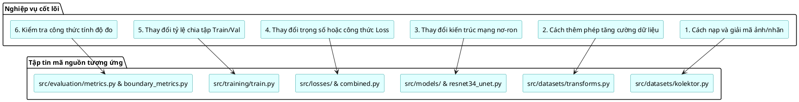

# 02. Cấu Trúc Kho Mã Nguồn (Repository Structure)

Tài liệu này cung cấp bản đồ chi tiết về cấu trúc thư mục của kho mã nguồn, giải thích chức năng của từng tệp tin và hướng dẫn người mới bắt đầu dễ dàng định vị các thành phần tương ứng với nghiệp vụ mong muốn.

---

## 1. Cây thư mục tổng thể (Directory Tree)

Dưới đây là cấu trúc tinh gọn của dự án (đã lược bỏ các thư mục bộ đệm `__pycache__`, siêu dữ liệu Git `.git`, và thư mục dữ liệu gốc khổng lồ):

```
surface-defect-segmentation/
│
├── configs/                                # Cấu hình tập trung toàn hệ thống
│   └── base.yaml                           # Định nghĩa tham số, đường dẫn, 5 cấu hình E0-E4
│
├── data/                                   # Thư mục chứa dữ liệu nghiên cứu
│   └── kolektorsdd2-DatasetNinja/          # Dữ liệu gốc KolektorSDD2 chuẩn hóa bởi DatasetNinja
│       ├── train/                          # 2,331 mẫu huấn luyện (ảnh tại img/, nhãn tại ann/)
│       └── test/                           # 1,004 mẫu kiểm thử
│
├── docs/                                   # Hệ thống tài liệu kỹ thuật chuyên sâu
│   ├── README.md                           # Trang chủ tài liệu & hướng dẫn đọc
│   ├── 01_project_overview.md              # Tổng quan bài toán, mục tiêu, 4 câu hỏi RQ
│   ├── 02_repository_structure.md          # Bản đồ cấu trúc repo & file chức năng
│   ├── 03_system_architecture.md           # Thiết kế kiến trúc, luồng thực thi, biểu đồ PlantUML
│   ├── 04_database_and_data_model.md       # Mô hình lưu trữ dữ liệu dạng tệp
│   ├── 05_function_reference.md            # Cẩm nang tra cứu hàm, lớp, tham số, logic
│   ├── 06_data_pipeline.md                 # Quy trình tiền xử lý, tăng cường, chống rò rỉ
│   ├── 07_project_progress.md              # Ma trận tiến độ thực tế, RTM, lộ trình P0-P3
│   ├── 08_setup_and_execution.md           # Hướng dẫn thiết lập môi trường & lệnh chạy
│   ├── 09_glossary_and_learning_guide.md   # Thuật ngữ chuyên sâu & lộ trình tự học
│   ├── 10_technical_debt_and_improvements.md # Nợ kỹ thuật, code rỗng, đề xuất nâng cấp
│   ├── 11_change_log_and_analysis_notes.md # Nhật ký kiểm toán, sai lệch docs vs code
│   ├── 02_dataset.md                       # Bản ghi đặc tả dataset cũ (tham chiếu)
│   └── interfaces.md                       # Hợp đồng giao tiếp giữa các module
│
├── experiments/                            # Lưu trữ kết quả và trọng số huấn luyện
│   ├── E0_baseline/                        # Kết quả thử nghiệm Baseline E0
│   │   ├── best.pt                         # Trọng số mô hình tốt nhất (PyTorch Checkpoint)
│   │   ├── history.csv                     # Nhật ký huấn luyện dạng bảng
│   │   ├── history.json                    # Nhật ký huấn luyện dạng JSON
│   │   ├── loss_curve.png                  # Biểu đồ hàm mất mát Train vs Val
│   │   ├── dice_curve.png                  # Biểu đồ chỉ số Dice Train vs Val
│   │   └── iou_curve.png                   # Biểu đồ chỉ số IoU Train vs Val
│   └── E0_baseline_smoke/                  # Kết quả chạy thử nghiệm nhanh (Smoke test)
│
├── notebooks/                              # Sổ tay Jupyter phục vụ phân tích dữ liệu
│   ├── 01_eda.ipynb                        # [STUB] File rỗng 0-byte
│   ├── 02_visualization.ipynb              # [STUB] File rỗng 0-byte
│   ├── 03_analysis.ipynb                   # [STUB] File rỗng 0-byte
│   └── 04_eda_kolektorsdd2.ipynb           # Sổ tay EDA hoàn chỉnh (phân tích, trực quan)
│
├── results/                                # Kết quả đầu ra của các tác vụ phân tích
│   └── eda/                                # Sản phẩm từ script run_eda.py
│       ├── dataset_statistics.csv          # Bảng thống kê chi tiết 3,338 dòng
│       ├── size_thresholds.json            # Ngưỡng kích thước khuyết tật tính theo phân vị
│       ├── defect_area_distribution.png    # Biểu đồ phân phối diện tích vết nứt (log-scale)
│       ├── defect_examples.png             # Trực quan mẫu khuyết tật kèm mask
│       ├── eda_summary.png                 # Tóm tắt trực quan phân tích dữ liệu
│       ├── image_dimensions.png            # Biểu đồ phân tán kích thước ảnh gốc
│       ├── image_mask_overlay_examples.png # Ảnh chụp chồng lớp mặt nạ lên phôi kim loại
│       └── positive_negative_by_split.png  # Tỷ lệ ảnh lỗi vs bình thường theo tập
│
├── scripts/                                # Các kịch bản thực thi dạng dòng lệnh (CLI)
│   ├── verify_dataset.py                   # Kiểm tra tính toàn vẹn và số lượng của dataset
│   ├── run_eda.py                          # Chạy phân tích thăm dò dữ liệu tự động
│   └── benchmark_model.py                  # [STUB] File rỗng 0-byte (chưa triển khai)
│
├── src/                                    # Toàn bộ mã nguồn cốt lõi của ứng dụng
│   ├── datasets/                           # Module nạp và biến đổi dữ liệu
│   │   ├── kolektor.py                     # Lớp Dataset KolektorSDD2 (hỗ trợ giải mã zlib)
│   │   └── transforms.py                   # Các phép biến đổi hình học (Resize, Flip)
│   │
│   ├── models/                             # Kiến trúc mạng nơ-ron học sâu
│   │   ├── resnet_encoder.py               # Xương sống ResNet-34 trích xuất đặc trưng
│   │   ├── multiscale.py                   # Khối Multi-Scale Feature Fusion (Atrous Conv)
│   │   ├── attention_gate.py               # Khối lọc đặc trưng Cổng chú ý (Attention Gate)
│   │   ├── decoder.py                      # Bộ giải mã U-Net Decoder (UpBlock, ConvBlock)
│   │   └── resnet34_unet.py                # Mô hình tổng thể tích hợp cờ cấu hình
│   │
│   ├── losses/                             # Các hàm mất mát chuyên biệt
│   │   ├── dice.py                         # Hàm mất mát Dice mềm (Soft Dice Loss)
│   │   ├── boundary.py                     # Hàm mất mát ranh giới vi phân hình thái học
│   │   └── combined.py                     # Hàm mất mát kết hợp tổng quát
│   │
│   ├── training/                           # Quản lý huấn luyện và ghi log
│   │   ├── trainer.py                      # Vòng lặp học tập từng epoch (Trainer class)
│   │   ├── train.py                        # Điểm khởi chạy CLI chính: python -m src.training.train
│   │   └── logger.py                       # Lưu checkpoint, file lịch sử và vẽ đồ thị
│   │
│   └── evaluation/                         # Thư viện tính toán độ đo và đánh giá
│       ├── metrics.py                      # Tính Dice, IoU, Precision, Recall, Image F1, Normal FPR
│       ├── boundary_metrics.py             # Tính toán độ đo ranh giới có dung sai (tolerance)
│       ├── visualization.py                # [STUB] File rỗng 0-byte (chưa triển khai)
│       └── benchmark.py                    # [STUB] File rỗng 0-byte (chưa triển khai)
│
├── .gitignore                              # Quy tắc bỏ qua tệp nặng và tệp tạm thời
├── README.md                               # Hướng dẫn khởi động nhanh dự án
├── request.txt                             # Đặc tả bài toán và yêu cầu gốc của đề tài
└── requirements.txt                        # Danh mục thư viện phụ thuộc của Python
```

---

## 2. Phân loại và Điểm vào chính của ứng dụng (Application Entry Points)

| Chức năng cần thực hiện | Điểm vào (Entry Point) | Cách thức gọi lệnh mẫu |
|:---|:---|:---|
| **Kiểm tra dữ liệu gốc** | `scripts/verify_dataset.py` | `python scripts/verify_dataset.py --data-root data/kolektorsdd2-DatasetNinja` |
| **Phân tích EDA dữ liệu** | `scripts/run_eda.py` | `python scripts/run_eda.py --data-root data/kolektorsdd2-DatasetNinja` |
| **Huấn luyện mô hình** | `src/training/train.py` | `python -m src.training.train --experiment E0_baseline --epochs 50` |
| **Cấu hình siêu tham số** | `configs/base.yaml` | Tinh chỉnh trực tiếp bằng trình soạn thảo văn bản |

---

## 3. Bản đồ định vị tính năng (Feature Navigation Guide)

Nếu bạn cần sửa đổi hoặc tìm hiểu một tính năng cụ thể, hãy tham chiếu bảng hướng dẫn sau:



1. **Tôi muốn hiểu cách nạp ảnh và giải mã mặt nạ JSON**:
   * Truy cập `src/datasets/kolektor.py`.
   * Tìm hàm `_decode_datasetninja_mask` để xem cách giải mã chuỗi `base64` và giải nén `zlib`.
2. **Tôi muốn thêm các phép biến đổi ảnh (như làm nhòe, đổi màu, xoay ngẫu nhiên)**:
   * Truy cập `src/datasets/transforms.py`.
   * Tạo thêm một lớp mới kế thừa mẫu Callable `Pair = tuple[Image.Image, Image.Image]`.
3. **Tôi muốn điều chỉnh độ sâu hoặc tỷ lệ giãn nở của Multi-Scale**:
   * Truy cập `src/models/multiscale.py`.
   * Tinh chỉnh tham số `dilation` trong danh sách `self.branches`.
4. **Tôi muốn xem cách Attention Gate hoạt động**:
   * Truy cập `src/models/attention_gate.py`.
   * Kiểm tra phương thức `forward(gate, skip)`.
5. **Tôi muốn thay đổi trọng số của hàm Boundary Loss**:
   * Truy cập `configs/base.yaml`.
   * Sửa giá trị tại khóa `loss.boundary_weight` (mặc định là `0.1`).
6. **Tôi muốn biết công thức tính Boundary F1**:
   * Truy cập `src/evaluation/boundary_metrics.py`.
   * Xem hàm `boundary_metrics` sử dụng toán tử hình thái học `binary_dilation` với `tolerance=2`.

---

## 4. Các tệp tin bị loại trừ và Lưu ý an toàn

* **Không lưu vào Git (theo `.gitignore`)**:
  * Các thư mục chứa ảnh thô: `data/raw/`, `data/kolektorsdd2-DatasetNinja/`.
  * Các checkpoint trọng số mô hình lớn: `experiments/**/*.pt`.
  * Môi trường ảo Python: `.venv/`, `venv/`, `env/`.
  * Bộ nhớ tạm của hệ thống: `.idea/`, `.vscode/`, `*.pyc`, `__pycache__/`.
* **Cảnh báo về các file rỗng 0-byte**:
  * Các file `scripts/benchmark_model.py`, `src/evaluation/visualization.py`, `src/evaluation/benchmark.py`, và 3 file jupyter notebook (`01_eda.ipynb`, `02_visualization.ipynb`, `03_analysis.ipynb`) hiện đang có dung lượng 0 byte. Khi phát triển các tính năng so sánh hiệu năng và trực quan hóa, lập trình viên cần triển khai mã nguồn cụ thể cho các file này.
