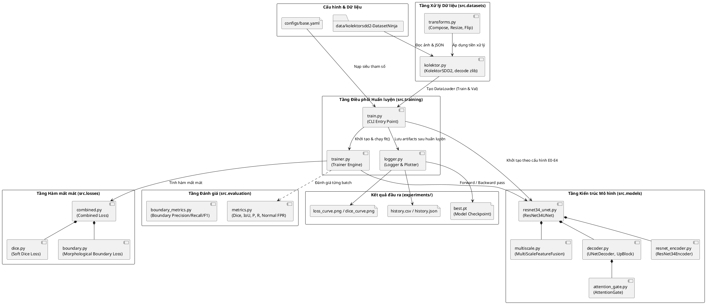
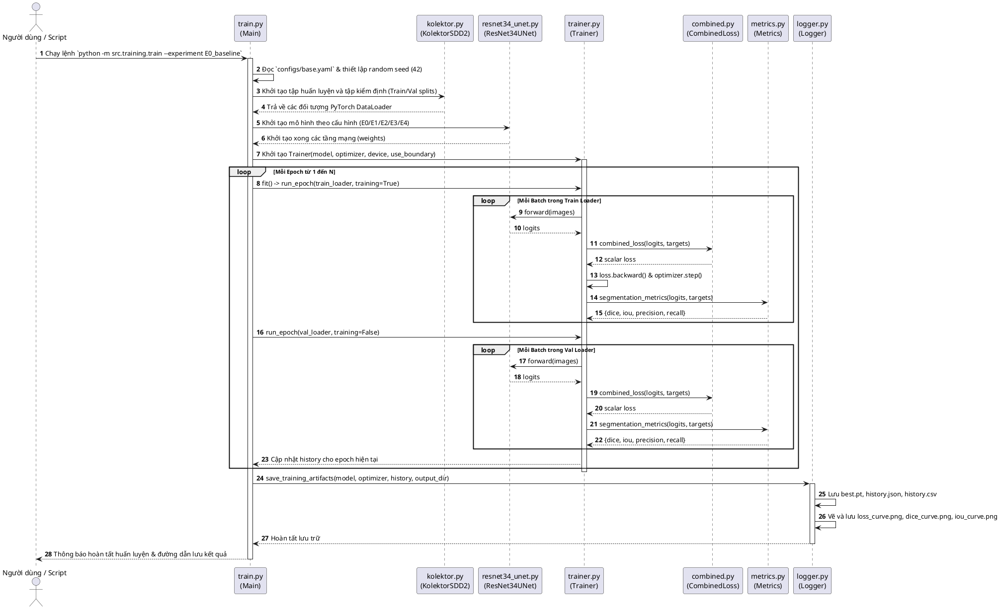

# 03. Thiết Kế Kiến Trúc Hệ Thống (System Architecture)

Tài liệu này phân tích chi tiết phong cách kiến trúc phần mềm, cấu trúc module hóa, vòng đời thực thi và các tương tác tuần tự giữa các thành phần trong hệ thống học sâu phân vùng khuyết tật bề mặt.

---

## 1. Phong cách kiến trúc tổng thể (Architectural Style)

Hệ thống được xây dựng theo phong cách **Kiến trúc Đường ống & Bộ lọc phân lớp (Layered Pipeline & Filters Architecture)** kết hợp với **Mô hình Khối có thể cấu hình (Configurable Component Pattern)**:

1. **Tầng Dữ liệu (Data Layer)**: Đảm nhiệm việc phát hiện cấu trúc thư mục, nạp dữ liệu từ đĩa, giải mã các bitmap nén nhị phân, chuẩn hóa kích thước và thực hiện các phép tăng cường ngẫu nhiên.
2. **Tầng Mô hình học sâu (Model Layer)**: Thiết kế dạng cắm ghép (pluggable blocks) xoay quanh mô hình chuẩn `ResNet34UNet`. Bằng cách truyền các cờ nhị phân (`multi_scale=True/False`, `attention=True/False`), hệ thống tự động định tuyến luồng tính toán mà không cần viết lại mã nguồn.
3. **Tầng Tối ưu & Mất mát (Optimization & Loss Layer)**: Tích hợp hàm mất mát đa mục tiêu, kết hợp giữa mất mát phân lớp điểm ảnh (BCE), mất mát vùng chồng lấn (Dice) và mất mát ranh giới vi phân hình thái học (Boundary Loss).
4. **Tầng Điều phối Huấn luyện (Training Engine Layer)**: Vòng lặp `Trainer` độc lập với phần cứng, tự động chuyển đổi giữa chế độ `train()` và `eval()`, tính toán độ dốc (gradients) và cập nhật trọng số `AdamW`.
5. **Tầng Đánh giá & Ghi log (Evaluation & Telemetry Layer)**: Theo dõi tiến trình qua từng epoch, lưu vết các chỉ số về file JSON/CSV, xuất ảnh đồ thị trực quan và lưu trữ checkpoint trọng số `best.pt`.

---

## 2. Sơ đồ các thành phần hệ thống (PlantUML Component Diagram)

---

## 3. Biểu đồ tuần tự luồng thực thi (PlantUML Sequence Diagram)

Sơ đồ dưới đây mô tả chi tiết vòng đời chạy một phiên huấn luyện từ khi gõ lệnh tại Terminal cho đến khi lưu Checkpoint và đồ thị:

---

## 4. Chi tiết cơ chế của các khối chuyên biệt

### 4.1. Khối Tổng hợp Đặc trưng Đa thang đo (Multi-Scale Feature Fusion Block)
Khối này nhận đầu vào là tensor đặc trưng sâu nhất từ Encoder (`feature4`, kích thước $512 \times 8 \times 8$). Khối triển khai 4 nhánh tích chập song song (Parallel Branches) với tỷ lệ giãn nở (dilation rates) khác nhau nhằm bắt trọn ngữ cảnh ở nhiều kích thước trường thụ cảm (receptive fields):
* **Nhánh 1**: $1 \times 1$ Conv (bảo tồn đặc trưng cục bộ điểm).
* **Nhánh 2**: $3 \times 3$ Conv, padding=1, dilation=1 (chuẩn).
* **Nhánh 3**: $3 \times 3$ Conv, padding=2, dilation=2 (bắt chi tiết trung bình).
* **Nhánh 4**: $3 \times 3$ Conv, padding=4, dilation=4 (bắt bối cảnh rộng).

Sau đó, 4 nhánh được ghép kênh (channel concatenation), chiếu qua một lớp tích chập $1 \times 1$ kèm BatchNorm và ReLU, rồi cộng với chính đầu vào thông qua kết nối phần dư (Residual Connection):
$$\text{Output} = \text{Project}(\text{Concat}(B_1, B_2, B_3, B_4)) + \text{Input}$$

### 4.2. Khối Cổng chú ý (Attention Gate Block)
Tại mỗi tầng giải mã (Decoder UpBlock), đặc trưng từ tầng dưới đưa lên đóng vai trò làm tín hiệu điều khiển (Gating signal $g$), còn đặc trưng từ Encoder đi sang là tín hiệu truyền tắt (Skip feature $x$).
1. Tín hiệu $g$ và $x$ được đưa về cùng số kênh trung gian thông qua phép tích chập $1 \times 1$:
   $$\phi(x, g) = W_g * g + W_x * x$$
2. Kích hoạt qua ReLU, sau đó chiếu về 1 kênh và qua hàm Sigmoid để tạo ma trận hệ số chú ý $\alpha \in [0, 1]$:
   $$\alpha = \sigma(W_\psi * \text{ReLU}(\phi(x, g)))$$
3. Nhân ma trận hệ số chú ý với đặc trưng truyền tắt ban đầu:
   $$\hat{x} = x \odot \alpha$$
Nhờ đó, những vùng vân nền không có tín hiệu khuyết tật sẽ bị nhân với giá trị gần 0, triệt tiêu tín hiệu giả trước khi đưa vào khối ghép kênh của Decoder.

### 4.3. Khối Hàm mất mát Ranh giới Vi phân (Differentiable Boundary Loss)
Thay vì trích xuất đường viền bằng thuật toán Canny hoặc Sobel truyền thống (vốn không thể lan truyền ngược đạo hàm trong PyTorch), hệ thống sử dụng các phép toán hình thái học vi phân được biểu diễn thông qua lớp `max_pool2d`:
* **Phép Dãn (Dilation)**: Phóng to vùng khuyết tật bằng Max Pooling cửa sổ $3 \times 3$:
  $$\text{Dilated}(M) = \text{MaxPool2D}(M, k=3, s=1, p=1)$$
* **Phép Co (Erosion)**: Thu nhỏ vùng khuyết tật bằng công thức đối ngẫu:
  $$\text{Eroded}(M) = -\text{MaxPool2D}(-M, k=3, s=1, p=1)$$
* **Bản đồ Ranh giới (Boundary Map)**:
  $$\text{Boundary}(M) = \text{Clamp}(\text{Dilated}(M) - \text{Eroded}(M), 0, 1)$$
Hàm mất mát ranh giới là Binary Cross-Entropy giữa ranh giới dự đoán từ xác suất (probabilities) và ranh giới mặt nạ nhãn thực tế:
$$L_{Boundary} = \text{BCE}(\text{Boundary}(P), \text{Boundary}(Y))$$

---

## 5. Xử lý lỗi, Giám sát và An toàn hệ thống

* **Xử lý ngoại lệ**:
  * Khi nạp ảnh tại `src/datasets/kolektor.py`, nếu ảnh bị lỗi hỏng hoặc thiếu file JSON, hệ thống ghi nhận trạng thái lỗi vào trường `integrity_status` mà không làm sập toàn bộ quy trình EDA.
  * Nếu DataLoader rỗng, `Trainer.run_epoch` ném ra lỗi `ValueError("Cannot run an epoch with an empty dataloader")` để cảnh báo sớm.
* **Tự động chuyển đổi phần cứng**:
  * Hệ thống tự động kiểm tra `torch.cuda.is_available()`. Nếu có GPU, PyTorch sẽ cấp phát tensor lên VRAM CUDA; nếu không, sẽ tự lùi về CPU mà không làm gián đoạn lệnh thực thi.
* **An toàn dữ liệu & Bí mật (Security & Privacy)**:
  * Không có bất kỳ API Key, mật khẩu cơ sở dữ liệu hay thông tin cá nhân nào được nhúng vào mã nguồn.
  * Các file trọng số `.pt` và dữ liệu ảnh gốc được cách ly hoàn toàn thông qua file `.gitignore`.
