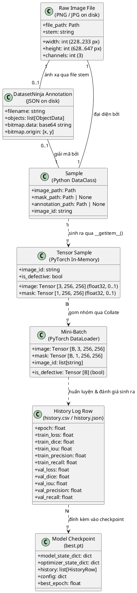

# 04. Mô Hình Dữ Liệu và Lưu Trữ (Data Model & Storage Architecture)

Tài liệu này đặc tả toàn bộ mô hình dữ liệu, cấu trúc lưu trữ dạng tệp tin (File-based Data Model), cấu trúc bản ghi nhãn và mô hình ánh xạ bộ nhớ (In-memory Tensor Data Model) được sử dụng trong dự án.

---

## 1. Khẳng định về Công nghệ Lưu trữ (Storage Technology Statement)

> **Lưu ý kiểm định quan trọng**:  
> Dự án này **KHÔNG sử dụng** hệ quản trị cơ sở dữ liệu quan hệ (RDBMS như PostgreSQL, MySQL) hay cơ sở dữ liệu phi quan hệ (NoSQL như MongoDB).  
> Toàn bộ dữ liệu được quản lý dưới dạng **Kiến trúc Lưu trữ Hướng Tệp (File-based Storage)** và **Cấu trúc Dữ liệu Bộ nhớ Động (In-memory PyTorch Data Structures)**.

Mô hình này tối ưu hóa độ trễ đọc/ghi bằng cách tận dụng hệ thống file của hệ điều hành kết hợp với các luồng công nhân nạp dữ liệu song song đa tiến trình (`num_workers` trong PyTorch DataLoader).

---

## 2. Sơ đồ Thực thể Dữ liệu (PlantUML Entity-Relationship / Class Diagram)

Sơ đồ dưới đây biểu diễn mối quan hệ giữa các thực thể vật lý trên đĩa và các thực thể dữ liệu trong bộ nhớ RAM/VRAM:



---

## 3. Đặc tả các cấu trúc dữ liệu chi tiết

### 3.1. Cấu trúc nhãn DatasetNinja JSON (`ann/*.json`)
Mỗi ảnh khuyết tật trong thư mục `img/` có một tệp JSON tương ứng cùng tên trong `ann/` (ví dụ `12330.png` tương ứng với `12330.png.json`).
* **Đối với ảnh bình thường (Normal)**: Tệp JSON có trường `"objects": []`.
* **Đối với ảnh khuyết tật (Defective)**: Mặt nạ nhị phân không lưu dưới dạng đa giác (polygon) phẳng mà được đóng gói thành **chuỗi bitmap nén**:

```json
{
  "description": "",
  "tags": [],
  "size": {
    "height": 634,
    "width": 229
  },
  "objects": [
    {
      "description": "",
      "bitmap": {
        "origin": [65, 320],
        "data": "eJzt1rEJwkAQANB/..."
      },
      "classTitle": "defect",
      "tags": []
    }
  ]
}
```

* **Quy trình giải mã nhãn (`_decode_datasetninja_mask`)**:
  1. Đọc chuỗi `object["bitmap"]["data"]`.
  2. Giải mã Base64: `base64.b64decode(data)`.
  3. Giải nén luồng byte zlib: `zlib.decompress(compressed)`.
  4. Đọc bitmap thành đối tượng PIL Image thang độ xám (grayscale mode `"L"`).
  5. Dán (paste) vùng khuyết tật lên một ảnh đen toàn phần (kích thước gốc $W \times H$) tại tọa độ gốc `origin: [x, y]`.

---

### 3.2. Cấu trúc cấu hình hệ thống (`configs/base.yaml`)
Cấu hình này là nguồn chân lý duy nhất (Single Source of Truth) cho các module chạy:

```yaml
project:
  name: surface-defect-segmentation
  seed: 42
  dataset: KolektorSDD2

paths:
  data_root: data/kolektorsdd2-DatasetNinja   # Đường dẫn thư mục dữ liệu gốc
  processed_root: data/processed              # Dữ liệu tiền xử lý (nếu có)
  splits_root: data/splits                    # Danh sách chia tập cố định
  experiments_root: experiments               # Nơi xuất artifacts huấn luyện
  results_root: results                       # Nơi xuất kết quả EDA & benchmark

data:
  image_size: 256                             # Kích thước resize vuông
  num_workers: 2                              # Số tiến trình nạp song song
  batch_size: 8                               # Kích thước mini-batch
  expected_images: 3335                       # Tổng số ảnh kỳ vọng
  expected_defective_images: 356              # Số ảnh lỗi kỳ vọng
  expected_normal_images: 2979                # Số ảnh bình thường kỳ vọng
  official_train_size: 2331                   # Số ảnh tập train chính thức
  official_test_size: 1004                    # Số ảnh tập test chính thức

training:
  epochs: 50                                  # Số chu kỳ huấn luyện
  learning_rate: 0.0001                       # Tốc độ học (AdamW)
  weight_decay: 0.00001                       # Hệ số phân rã trọng số
  device: auto                                # Tự chọn 'cuda' hoặc 'cpu'

loss:
  boundary_weight: 0.1                        # Hệ số lambda cho Boundary Loss

evaluation:
  image_defect_threshold: 0.0                 # Ngưỡng diện tích coi là ảnh lỗi
  boundary_tolerance: 2                       # Dung sai viền (pixel)

experiments:                                  # Bảng công tắc các cấu hình
  E0_baseline: { multi_scale: false, attention: false, boundary_loss: false }
  E1_multiscale: { multi_scale: true, attention: false, boundary_loss: false }
  E2_attention: { multi_scale: false, attention: true, boundary_loss: false }
  E3_boundary: { multi_scale: false, attention: false, boundary_loss: true }
  E4_full: { multi_scale: true, attention: true, boundary_loss: true }
```

---

### 3.3. Cấu trúc bảng thống kê EDA (`results/eda/dataset_statistics.csv`)
Gồm 3,338 dòng (gồm header và 3,335 mẫu dữ liệu), mỗi dòng là một bản ghi:
* `split`: `train` hoặc `test`.
* `image_id`: Định danh ảnh (ví dụ `10000`).
* `filename`: Tên tệp ảnh (`10000.png`).
* `width`, `height`, `channels`, `aspect_ratio`: Thuộc tính hình học gốc.
* `has_defect`: Giá trị boolean (`True` nếu có pixel lỗi, `False` nếu sạch).
* `mask_area_px`: Tổng số pixel của khuyết tật trên ảnh gốc.
* `relative_defect_area_pct`: Tỷ lệ phần trăm diện tích lỗi so với toàn ảnh.
* `num_components`: Số lượng vùng khuyết tật rời rạc (tính theo 8-connectivity).
* `largest_component_area_px`: Diện tích vùng khuyết tật lớn nhất.
* `integrity_status`: Trạng thái toàn vẹn (`OK` hoặc chuỗi lỗi ngoại lệ).
* `defect_size`: Phân loại kích thước (`normal`, `small`, `medium`, `large`).

---

### 3.4. Cấu trúc Checkpoint mô hình (`best.pt`)
Tệp nhị phân được tuần tự hóa (serialized) bằng `torch.save`, chứa một `dict` gồm các khóa:
* `"model_state_dict"`: Toàn bộ trọng số tensor và tham số thống kê BatchNorm của mạng.
* `"optimizer_state_dict"`: Trạng thái moment bậc 1 và bậc 2 của bộ tối ưu AdamW.
* `"history"`: Danh sách toàn bộ các giá trị loss và metrics qua từng epoch.
* `"config"`: Bản sao cấu hình YAML được sử dụng khi huấn luyện.
* `"best_epoch"`: Số thứ tự epoch đạt chỉ số `val_dice` cao nhất.

---

## 4. Vòng đời dữ liệu (Data Lifecycle)

```
[Khởi tạo Dữ liệu trên đĩa]
            │
            ▼
[Kiểm tra Toàn vẹn: scripts/verify_dataset.py]
            │
            ▼
[Phân tích Thống kê: scripts/run_eda.py] ──> Xuất results/eda/ (CSV, JSON, PNG)
            │
            ▼
[Nạp & Tiền xử lý: src/datasets/kolektor.py]
  - Đọc file ảnh (RGB)
  - Giải mã bitmap zlib (L)
  - Biến đổi Pair: Resize(256) + Flip
  - Chuyển thành PyTorch Tensor (float32)
            │
            ▼
[Tạo Batch: torch.utils.data.DataLoader] ──> Ghép mini-batch [B, C, H, W]
            │
            ▼
[Huấn luyện & Suy luận: Trainer Engine]
            │
            ▼
[Ghi vết & Lưu trữ: src/training/logger.py] ──> Lưu Checkpoint & Biểu đồ PNG
```
