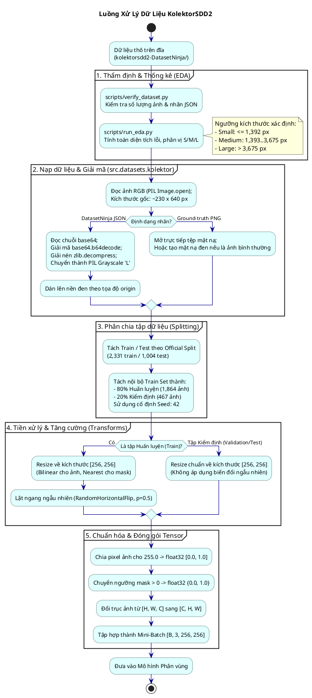

# 06. Đường Ống Xử Lý Dữ Liệu (Data Pipeline)

Tài liệu này mô tả chi tiết toàn bộ chu trình xử lý dữ liệu từ ảnh thô trên đĩa, quá trình giải mã mặt nạ, phân chia tập dữ liệu, kỹ thuật chống rò rỉ thông tin (Data Leakage) đến các phép tăng cường dữ liệu phục vụ huấn luyện.

---

## 1. Sơ đồ chu trình xử lý dữ liệu từ đầu đến cuối (End-to-End Pipeline)

---

## 2. Đặc điểm tập dữ liệu KolektorSDD2

Tập dữ liệu **KolektorSDD2** (Kolektor Surface Defect Detection 2) là bộ chuẩn benchmark công nghiệp chuyên biệt cho việc phát hiện khuyết tật trên các bề mặt chi tiết điện tử/kim loại:

| Chỉ số thống kê | Tập Train chính thức | Tập Test chính thức | Toàn bộ tập dữ liệu |
|:---|:---:|:---:|:---:|
| **Tổng số ảnh** | 2,331 (69.9%) | 1,004 (30.1%) | **3,335** (100%) |
| **Ảnh có khuyết tật (Defective)** | 246 (10.6%) | 110 (11.0%) | **356** (10.7%) |
| **Ảnh bình thường (Normal)** | 2,085 (89.4%) | 894 (89.0%) | **2,979** (89.3%) |
| **Kích thước ảnh gốc** | Chiều rộng: 228 – 233 px | Chiều cao: 628 – 647 px | Tỷ lệ khung hình: $\approx 0.36$ |

---

## 3. Chiến lược Phân chia và Phòng chống Rò rỉ Dữ liệu (Data Leakage Prevention)

Rò rỉ dữ liệu (Data Leakage) là rủi ro nghiêm trọng hàng đầu trong các bài toán học sâu, đặc biệt khi các ảnh trong cùng một lô sản phẩm có bề mặt tương tự nhau. Dự án áp dụng các nguyên tắc phòng ngừa nghiêm ngặt:

1. **Tuân thủ Official Split**: Tập kiểm thử chính thức (`test/`, 1,004 ảnh) được bảo lưu độc lập hoàn toàn, không bao giờ được chạm tới trong toàn bộ quá trình huấn luyện và chọn siêu tham số.
2. **Cô lập phép biến đổi (Transform Isolation)**:
   * Tập huấn luyện (`train_dataset_with_augmentation`): Áp dụng `Resize(256)` kèm `RandomHorizontalFlip()`.
   * Tập kiểm định nội bộ (`validation_dataset`): **Tuyệt đối không áp dụng lật ngẫu nhiên**, chỉ sử dụng duy nhất `Resize(256)` để đảm bảo độ đo kiểm định phản ánh chính xác phân phối tĩnh.
3. **Cố định hạt giống ngẫu nhiên (Deterministic Generator Seed)**:
   * Việc chia tập 80/20 được kiểm soát thông qua `torch.Generator().manual_seed(42)` trong hàm `torch.utils.data.random_split`. Điều này đảm bảo mỗi lần chạy lại thực nghiệm, cùng 1,864 ảnh sẽ vào tập huấn luyện và cùng 467 ảnh sẽ vào tập kiểm định, cho phép so sánh tuyệt đối công bằng giữa E0, E1, E2, E3 và E4.
4. **Xử lý ngưỡng kích thước khuyết tật độc lập**:
   * Các ngưỡng diện tích khuyết tật (Small $\le 1392$ px, Medium $\le 3675$ px) được tính **chỉ dựa trên các ảnh khuyết tật của tập Train**, không sử dụng thông tin phân phối của tập Test để tránh rò rỉ phân phối nhãn (label distribution leak).

---

## 4. Các phép tiền xử lý và Tăng cường dữ liệu (Preprocessing & Augmentation)

### 4.1. Chuẩn hóa hình học (Spatial Resizing)
Do các kiến trúc mạng nơ-ron tích chập (đặc biệt là các khối nối tắt Skip Connections trong U-Net) yêu cầu kích thước tensor chia hết cho $2^5 = 32$, ảnh đầu vào được đưa về kích thước cố định $256 \times 256$:
* **Ảnh đầu vào**: Dùng phương pháp song tuyến tính (Bilinear Interpolation):
  $$I_{\text{resized}} = \text{Resize}_{\text{bilinear}}(I, 256, 256)$$
* **Mặt nạ nhãn**: Dùng phương pháp láng giềng gần nhất (Nearest Neighbor) để giữ nguyên giá trị nhị phân $\{0, 1\}$, tránh tạo ra các pixel có giá trị chuyển tiếp lơ lửng giữa 0 và 1.

### 4.2. Chuẩn hóa giá trị cường độ sáng (Pixel Intensity Normalization)
Các giá trị pixel ảnh từ $[0, 255]$ được chuyển đổi kiểu dữ liệu về `np.float32` và chia cho $255.0$ để đưa về đoạn $[0.0, 1.0]$. Mặt nạ được ép kiểu nhị phân nhọn:
$$M_{\text{binary}} = (M > 0).astype(np.float32)$$

### 4.3. Lật ngẫu nhiên đồng bộ (Synchronized Flips)
Khi áp dụng lật ngang `RandomHorizontalFlip(p=0.5)` hoặc lật dọc `RandomVerticalFlip(p=0.5)`, cả ảnh gốc và mặt nạ bắt buộc phải được lật cùng một lúc bằng cùng một phép toán hình học để giữ nguyên vị trí tương đối của vùng khuyết tật:
$$(I', M') = (\text{Flip}(I), \text{Flip}(M))$$
