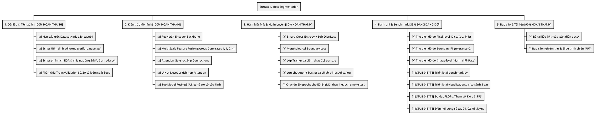
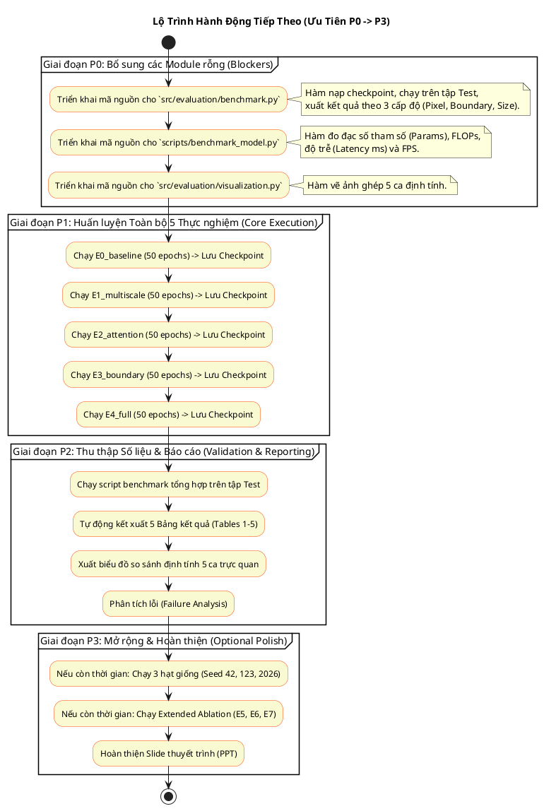

# 07. Tiến Độ Thực Tế và Lộ Trình Triển Khai (Project Progress & Roadmap)

Tài liệu này phản ánh trung thực, khách quan hiện trạng của kho mã nguồn dựa trên các bằng chứng vật lý thu thập được từ đợt kiểm định mã nguồn (Code Audit), đối chiếu chi tiết với các yêu cầu kỹ thuật trong tệp `request.txt`, và xác lập kế hoạch hành động cụ thể cho các bước tiếp theo.

---

## 1. Biểu đồ Tiến độ và Phân rã Công việc (PlantUML WBS & Roadmap)

---

## 2. Ma trận Đối soát Yêu cầu kỹ thuật (Requirements Traceability Matrix - RTM)

Đối soát giữa yêu cầu kỹ thuật tại `request.txt` và hiện trạng triển khai trong kho mã nguồn:

| Mã YC | Yêu cầu kỹ thuật (trích `request.txt`) | Bằng chứng kiểm định trong Repo | Trạng thái thực tế | Hạng mục còn thiếu / Cần làm tiếp | Tập tin liên quan |
|:---:|:---|:---|:---:|:---|:---|
| **REQ-01** | Hỗ trợ tập dữ liệu KolektorSDD2 (3,335 ảnh, 356 defective, 2,979 normal) | Đã kiểm định qua `scripts/run_eda.py`, xuất ra `results/eda/dataset_statistics.csv` đúng 3,335 ảnh. | `[COMPLETED & VERIFIED]` | Đã hoàn thành toàn bộ. | `src/datasets/kolektor.py`, `results/eda/` |
| **REQ-02** | Xây dựng Baseline E0: ResNet34-UNet với hàm mất mát BCE + Dice | `src/models/resnet34_unet.py`, `src/losses/combined.py`. Đã có output tại `experiments/E0_baseline/`. | `[COMPLETED & VERIFIED]` | Cần chạy huấn luyện đầy đủ 50 epochs (hiện chỉ chạy 1 epoch smoke test). | `src/models/resnet34_unet.py`, `src/training/train.py` |
| **REQ-03** | Khối Multi-Scale Feature Fusion (E1) | Đã triển khai tại `src/models/multiscale.py` với 4 nhánh Atrous Conv. | `[IMPLEMENTED, NOT VERIFIED]` | Cần kích hoạt chạy thực nghiệm huấn luyện `E1_multiscale`. | `src/models/multiscale.py`, `configs/base.yaml` |
| **REQ-04** | Cổng chú ý Attention Gate (E2) | Đã triển khai tại `src/models/attention_gate.py` và tích hợp vào `decoder.py`. | `[IMPLEMENTED, NOT VERIFIED]` | Cần kích hoạt chạy thực nghiệm huấn luyện `E2_attention`. | `src/models/attention_gate.py`, `src/models/decoder.py` |
| **REQ-05** | Hàm mất mát ranh giới Boundary-Aware Loss (E3) | Đã triển khai tại `src/losses/boundary.py` sử dụng phép dãn nở/co `max_pool2d`. | `[IMPLEMENTED, NOT VERIFIED]` | Cần kích hoạt chạy thực nghiệm huấn luyện `E3_boundary`. | `src/losses/boundary.py`, `src/losses/combined.py` |
| **REQ-06** | Mô hình tích hợp đầy đủ E4 Full Model | Tích hợp thành công trong `ResNet34UNet` và cấu hình `configs/base.yaml`. | `[IMPLEMENTED, NOT VERIFIED]` | Cần kích hoạt chạy thực nghiệm huấn luyện `E4_full`. | `src/models/resnet34_unet.py` |
| **REQ-07** | Đo đạc chỉ số ranh giới Boundary Precision, Recall, F1 | Đã code xong `src/evaluation/boundary_metrics.py` với hàm dung sai viền `tolerance=2`. | `[COMPLETED & VERIFIED]` | Chạy batch evaluation trên tập Test sau khi có trọng số E0-E4. | `src/evaluation/boundary_metrics.py` |
| **REQ-08** | Phân tích khuyết tật theo kích thước (Small, Medium, Large) | Đã xác định ngưỡng tại `results/eda/size_thresholds.json` và code hàm `defect_size_bucket`. | `[COMPLETED & VERIFIED]` | Đưa vào pipeline đánh giá tổng hợp của mô hình. | `src/evaluation/metrics.py`, `results/eda/size_thresholds.json` |
| **REQ-09** | Đánh giá cấp độ ảnh: Image F1 & Normal FP Rate | Đã code xong hàm `image_level_metrics` trong `src/evaluation/metrics.py`. | `[COMPLETED & VERIFIED]` | Đưa vào bảng tổng hợp kết quả cuối cùng. | `src/evaluation/metrics.py` |
| **REQ-10** | Trực quan hóa định tính 5 trường hợp (Qualitative 5 Cases) | `src/evaluation/visualization.py` hiện là file rỗng (0 bytes). | `[NOT IMPLEMENTED]` | Viết mã nguồn cho `visualization.py` để xuất ảnh ghép so sánh: Input \| GT \| E0 \| E1 \| E2 \| E3 \| E4. | `src/evaluation/visualization.py` |
| **REQ-11** | Bảng Benchmark hiệu năng tính toán (Params, FLOPs, Latency, FPS) | `src/evaluation/benchmark.py` và `scripts/benchmark_model.py` hiện là file rỗng (0 bytes). | `[NOT IMPLEMENTED]` | Triển khai mã tính FLOPs (qua `thop` hoặc `fvcore`), đo tham số và đo thời gian suy luận (GPU Latency / FPS). | `scripts/benchmark_model.py`, `src/evaluation/benchmark.py` |
| **REQ-12** | 5 Bảng báo cáo kết quả cuối cùng (Table 1 đến Table 5) | Chưa xuất hiện trong `results/` do các thực nghiệm chưa chạy xong. | `[NOT IMPLEMENTED]` | Chạy benchmark tự động xuất ra `results/metrics.csv` và các bảng Markdown. | `results/` |

---

## 3. Ma trận Hiện Trạng Module Hệ Thống (Implementation Status Matrix)

| Module / Luồng công việc | Trạng thái hiện tại | Bằng chứng kiểm định thực tế | Nhiệm vụ kỹ thuật còn lại | Phụ thuộc (Dependencies) |
|:---|:---:|:---|:---|:---|
| **Data Ingestion** | `[COMPLETED & VERIFIED]` | Nạp tốt cả 2 định dạng, đã chạy qua 3,335 ảnh trong script EDA mà không phát sinh lỗi. | Không còn. | Không |
| **Model Architectures** | `[COMPLETED & VERIFIED]` | ResNet34Encoder, Decoder, AttentionGate, MultiScale, TopModel hoạt động trơn tru. | Kiểm thử thêm trên dữ liệu kích thước động (nếu cần). | `torch`, `torchvision` |
| **Loss Functions** | `[COMPLETED & VERIFIED]` | BCE, Soft Dice Loss, Vi phân Boundary Loss đạo hàm chuẩn. | Thử nghiệm độ nhạy của hệ số $\lambda$ (hiện cố định 0.1). | `torch` |
| **Training Pipeline** | `[COMPLETED & VERIFIED]` | Đã chạy thử 1 epoch trên E0, tạo đủ file `.pt`, `.json`, `.csv`, `.png`. | Chỉ cần tăng tham số `--epochs 50` khi chạy huấn luyện chính thức. | GPU / CUDA |
| **Evaluation Suite** | `[PARTIALLY IMPLEMENTED]` | Các hàm tính toán số học đã có, nhưng thiếu script điều phối toàn bộ tập Test. | Viết logic cho `src/evaluation/benchmark.py`. | Trọng số `best.pt` của E0-E4 |
| **Visualization Tool** | `[NOT IMPLEMENTED]` | Tệp `src/evaluation/visualization.py` 0 bytes. | Viết hàm trích xuất 5 ca điển hình (dễ, nhỏ, tương phản thấp, viền khó, báo động giả). | Trọng số `best.pt` của E0-E4 |
| **Computational Benchmark** | `[NOT IMPLEMENTED]` | Tệp `scripts/benchmark_model.py` 0 bytes. | Viết script nạp dummy tensor `[1, 3, 256, 256]` đo FLOPs, Latency trên GPU. | `torch.cuda` |
| **Notebooks Nghiên cứu** | `[PARTIALLY IMPLEMENTED]` | Notebook 04 hoàn thiện; 01, 02, 03 hiện là 0 bytes. | Đồng bộ nội dung phân tích vào các notebook 01, 02, 03 hoặc dọn dẹp. | Jupyter |

---

## 4. Lộ trình Triển khai Chi tiết theo Thứ tự Ưu tiên (Prioritized Action Roadmap)

Sơ đồ tuần tự các bước tiếp theo cần thực hiện:

### Chi tiết các gói công việc:

### 🔴 Ưu tiên P0 (Cấp bách - Phải làm ngay trước khi đánh giá)
1. **Hoàn thiện `src/evaluation/benchmark.py`**:
   * Xây dựng hàm `evaluate_model(model, test_loader, device)` duyệt qua 1,004 ảnh tập test.
   * Tính toán và gom nhóm các chỉ số theo 3 nhóm kích thước: Small ($\le 1392$ px), Medium ($1393 - 3675$ px) và Large ($> 3675$ px).
2. **Hoàn thiện `scripts/benchmark_model.py`**:
   * Dùng `torch.cuda.Event` để đo độ trễ suy luận chính xác trên GPU.
   * Tính số lượng tham số có thể học được: `sum(p.numel() for p in model.parameters() if p.requires_grad)`.
3. **Hoàn thiện `src/evaluation/visualization.py`**:
   * Lọc và lưu 5 trường hợp mẫu theo yêu cầu: Easy defect, Tiny defect, Low-contrast defect, Ambiguous boundary, và Normal image có nguy cơ False Positive.

### 🟡 Ưu tiên P1 (Nghiệp vụ cốt lõi của đề tài)
1. **Huấn luyện đủ 50 epochs cho 5 cấu hình**:
   * Khuyến nghị đẩy code lên Kaggle (như hướng dẫn trong `README.md`) để tận dụng GPU T4/P100 miễn phí.
   * Chạy tuần tự các lệnh:
     * `python -m src.training.train --experiment E0_baseline --epochs 50`
     * `python -m src.training.train --experiment E1_multiscale --epochs 50`
     * `python -m src.training.train --experiment E2_attention --epochs 50`
     * `python -m src.training.train --experiment E3_boundary --epochs 50`
     * `python -m src.training.train --experiment E4_full --epochs 50`

### 🟢 Ưu tiên P2 (Đối soát khoa học & Hoàn tất nghiệm thu)
1. Kết xuất các bảng số liệu Markdown/LaTeX từ kết quả benchmark:
   * **Table 1**: Main Segmentation Metrics (Dice, IoU, Precision, Recall, Boundary F1).
   * **Table 2**: Ablation Study (MS vs AG vs BL).
   * **Table 3**: Defect Size Breakdown (Small Dice, Medium Dice, Large Dice).
   * **Table 4**: Image-level Inspection (Image F1, Normal FP Rate).
   * **Table 5**: Computational Efficiency (Params, FLOPs, Latency, FPS).
2. Lập bảng phân tích nguyên nhân lỗi (Failure Analysis) gồm 5 loại: Missed tiny, Missed low-contrast, Boundary leakage, False positive, Defect merging.

### ⚪ Ưu tiên P3 (Tùy chọn nâng cao nếu còn thời gian)
1. Chạy lặp lại thực nghiệm trên 3 seed (`42`, `123`, `2026`) để tính khoảng tin cậy thống kê $\text{Mean} \pm \text{Std}$.
2. Chạy bổ sung các cấu hình kết hợp 2 thành phần (E5: MS+AG, E6: MS+BL, E7: AG+BL).
